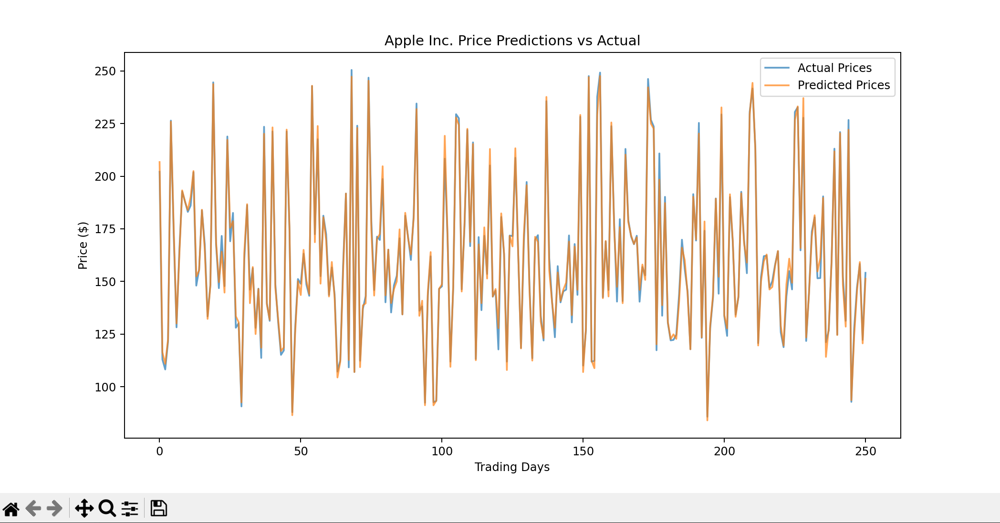

# Stock Market Prediction System 📈

A machine learning-powered stock price predictor that forecasts next-day closing prices using historical market data.

## Features ✨

- Select from 5 major tech stocks (AAPL, GOOGL, MSFT, AMZN, TSLA)
- Real-time data fetching from Yahoo Finance
- Displays:
  - Last 5 trading days' closing prices
  - Current market price
  - Predicted next-day closing price
  - Model accuracy (R² score)
- Interactive visualization of predictions vs actual prices

## Installation ⚙️

```bash
pip install -r requirements.txt
```

## How to Run

```bash
python main.py
```

## Example Output

```bash
Available Stocks:
AAPL: Apple Inc.
GOOGL: Alphabet Inc. (Google)
MSFT: Microsoft Corporation
AMZN: Amazon.com Inc.
TSLA: Tesla Inc.

Enter tickers (comma-separated, e.g., AAPL,MSFT): aapl

🚀 Processing your stocks...
YF.download() has changed argument auto_adjust default to True
[*********************100%***********************]  1 of 1 completed

📈 Apple Inc. (AAPL) Analysis:

Last 5 Trading Days:
Price        Close
Ticker        AAPL
Date
2025-05-15  211.45
2025-05-16  211.26
2025-05-19  208.78
2025-05-20  206.86
2025-05-21  202.09

Current Closing Price: $202.09
Predicted Next Closing Price: $202.19
Model R² Score: 0.99
```


